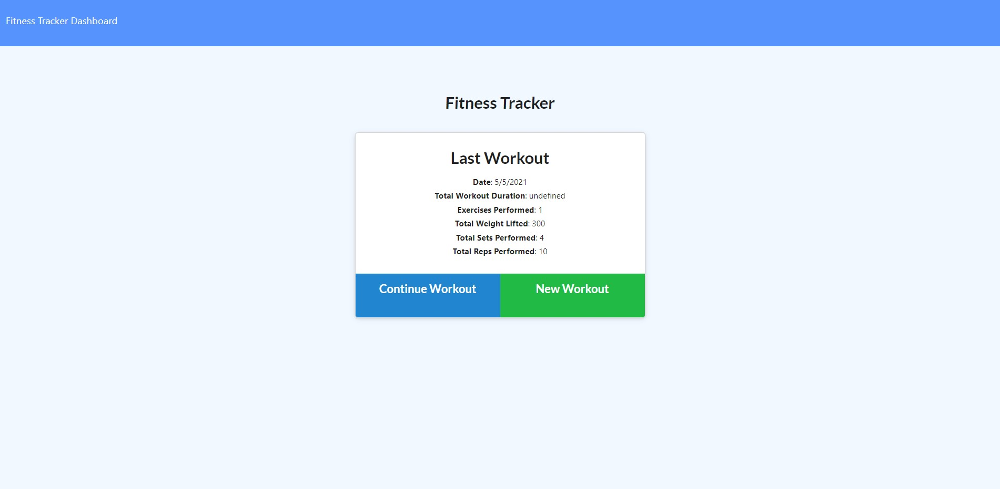

[![LinkedIn][linkedin-shield]][linkedin-url]

# Workout-Tracker

https://agile-ocean-98188.herokuapp.com/?id=6095e31032615a0015e2b7b5

## Description

Workout-Tracker allows you to input workouts, add exersizes, edit workouts, and view all workouts on a dashboard.

## Table of Contents

- [Installation](#installation)
- [Usage](#usage)
- [Credits](#credits)
- [License](#license)
- [Contributing](#contributing)
- [Tests](#tests)
- [Questions](#questions)

## Installation

Please follow the link and click on `New Workout` to start up.

## License

License:

MIT

## Contributing

Created by [https://github.com/UnDuhDuhSea](https://github.com/https://github.com/UnDuhDuhSea)

## Questions

Please feel free to send me an email or reach out on github!

Github: [https://github.com/UnDuhDuhSea](https://github.com/https://github.com/UnDuhDuhSea)

Email: [tafimba@gmail.com](https://github.com/tafimba@gmail.com)

<!-- MARKDOWN LINKS & IMAGES -->

[linkedin-shield]: https://img.shields.io/badge/-LinkedIn-black.svg?style=for-the-badge&logo=linkedin&colorB=555
[linkedin-url]: www.linkedin.com/in/tyler-abegg
